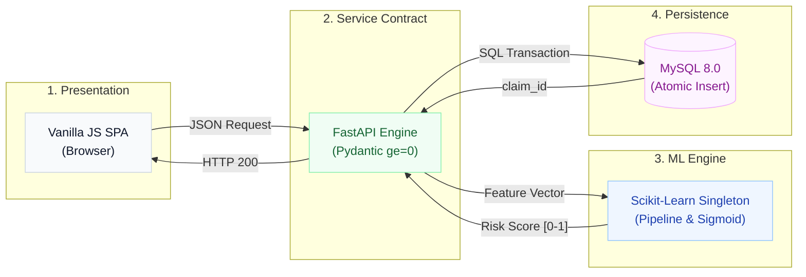

# 🛡️ RiskGuard
**Operationalizing Machine Learning for Insurance Risk Assessment**

> 🔐 Licensed under **Apache License 2.0**  
> 📌 Developed by **Sri Vighna Teja** | 2026 | Portfolio Project

<div align="center">
  
  
  
  
  
</div>

---

## Executive Summary

RiskGuard is an end-to-end classification system that bridges the gap between isolated data science models and transactional enterprise software. It evaluates insurance claims in real-time, combining **machine learning inference**, **strict API contracts**, and **ACID-compliant persistence** to automate risk triage.

Designed to demonstrate the core competencies of a **Technical / AI Consultant**, this project emphasizes systems architecture, quality engineering, explainable AI, and forensic root cause analysis over theoretical model complexity.

---

## 🏛️ System Architecture

RiskGuard implements a decoupled, 4-tier architecture. It explicitly manages the friction point where unconstrained ML mathematical boundaries meet rigid database storage constraints.



---

## 💡 Engineering & Consulting Decisions

In technical consulting, the "why" matters as much as the "how". Here is the rationale behind the system's design:

| Requirement / Challenge | Technical Implementation | Consulting Rationale |
| :--- | :--- | :--- |
| **Model Interpretability** | **Logistic Regression** (vs. Black-box Ensembles) | Insurance and financial domains require feature attribution for compliance. Logistic regression provides explainable log-odds and sub-15ms inference latency. |
| **Data Integrity** | **Dual-layer validation** (Pydantic + MySQL `CHECK`) | ML models don't crash on negative ages; they output garbage. Enforcing `ge=0` at both the API and DB levels protects model integrity. |
| **Transaction Reliability** | **Raw SQL `start_transaction()`** (vs. Heavy ORMs) | Ensures absolute visibility into SQL execution paths and guarantees atomic persistence across `claims` and `risk_results` tables. |
| **Quality Assurance** | **Dual UI Benchmarking** (Playwright vs. Selenium) | Proves tool-agnostic capability. Benchmarking revealed Playwright's WebSocket auto-waiting executed 57% faster (5.3s vs 12.5s) than Selenium's HTTP polling. |

---

## 📊 Explainable ML Performance

The model predicts the probability ($0.0 \rightarrow 1.0$) that a claim requires manual `REVIEW`.

*   **Architecture**: `ColumnTransformer` (StandardScaler + OneHotEncoder) $\rightarrow$ `LogisticRegression`.
*   **Evaluation**: Tested on an 80-sample held-out stratified test set.

<div align="center">

| Metric | Score | Business Impact |
| :--- | :---: | :--- |
| **Accuracy** | **87.5%** | Solid baseline reliability for automated triage routing. |
| **Precision** | **85.7%** | High precision means fewer false alarms, minimizing costly underwriter audit fatigue. |
| **Recall** | **80.0%** | Catches 80% of true high-risk claims, protecting organizational capital. |
| **Latency** | **<15ms** | In-memory singleton (`joblib`) eliminates network overhead of separate model servers. |

</div>

---

## 🔍 Forensic Engineering & RCA

A standout feature of this repository is its rigorous approach to failure isolation. (See full [Root Cause Analysis Logs](docs/troubleshooting-rca.md)).

**Incident Spotlight: The $1B Boundary Divergence**
*   **The Symptom**: A test claim with `amount = 999,999,999` passed local ML tests but triggered an `HTTP 500` in the live API.
*   **The Root Cause**: *Scope divergence*. The ML sigmoid function mathematically handles infinite inputs seamlessly in Python memory. However, the system's MySQL layer defined the column as `DECIMAL(10,2)`, which has a hard ceiling of `99,999,999.99`. The model didn't fail; the storage layer overflowed.
*   **The Takeaway**: Models cannot be tested in isolation. True validation requires pushing data through the complete `HTTP → Pydantic → ML → MySQL` stack to expose boundary mismatches.

---

## 💻 Interface & Workflow Verification

The system is fortified by **25 automated assertions** spanning UI, API contracts, database joins, and ML behavioral thresholds.

<table width="100%" style="border-collapse: collapse;">
  <tr>
    <td width="50%" align="center" style="border: none; padding: 10px;">
      <b>🟢 1. Valid Claim Ingestion & ML Scoring</b><br/><br/>
      
      <p align="left"><i>API returns generated ID, 0.995 risk score, and REVIEW decision. Persisted atomically to MySQL.</i></p>
    </td>
    <td width="50%" align="center" style="border: none; padding: 10px;">
      <b>🔵 2. Relational State Retrieval (SQL JOIN)</b><br/><br/>
      
      <p align="left"><i>GET endpoint executes an inner JOIN to reconstruct the claim and its associated ML result.</i></p>
    </td>
  </tr>
  <tr>
    <td width="50%" align="center" style="border: none; padding: 10px;">
      <b>🟡 3. API Contract Boundary Enforcement</b><br/><br/>
      
      <p align="left"><i>Pydantic intercepts negative values and invalid strings, protecting the ML engine from garbage data.</i></p>
    </td>
    <td width="50%" align="center" style="border: none; padding: 10px;">
      <b>🔴 4. Graceful Fault Handling</b><br/><br/>
      
      <p align="left"><i>404 Entity Not Found handling prevents database connection leaks and unhandled backend exceptions.</i></p>
    </td>
  </tr>
</table>

---

## 💼 Why This Matters for Technical Consulting

This repository serves as evidence of the ability to operate at the intersection of **AI, Engineering, and Business Strategy**:

1.  **Systems over Scripts**: I don't just train models; I build the API contracts, database schemas, and UIs required to operationalize them securely.
2.  **Quality & Defensive Posture**: I believe unverified software is broken software. I implement cross-tier testing (Playwright, Selenium, Pytest, SQL assertions) to guarantee resilience.
3.  **Technical Communication**: I translate complex system failures into actionable root cause analyses, bridging the gap between engineering implementations and business reliability.

---

## 🚀 Quickstart & Reproduction

**1. Setup Environment**
```bash
python3 -m venv .venv
source .venv/bin/activate
pip install -r requirements.txt
```

**2. Initialize MySQL Database**
*(Ensure MySQL 8.0+ is running locally)*
```bash
mysql -u root -p < sql/schema.sql
```
*(Update `.env` with your DB credentials).*

**3. Run the Services**
```bash
# Terminal 1: Start FastAPI backend
uvicorn backend.main:app --host 127.0.0.1 --port 8000

# Terminal 2: Serve Frontend
cd frontend && python3 -m http.server 8080 --bind 127.0.0.1
```

**4. Execute Test Suites**
```bash
pytest tests/selenium/ -v                 # Selenium UI Tests
python3 docs/run_api_db_validations.py    # API/DB Contract Asserts
python3 docs/run_ml_evaluation.py         # ML Performance Metrics
```

---
*For a deeper dive, explore the [Postman Collection](docs/riskguard_postman_collection.json), [Manual QA Plan](docs/manual-test-cases.md), or [RCA Documentation](docs/troubleshooting-rca.md).*
