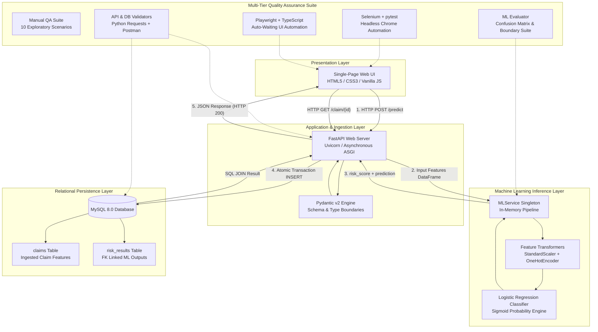

# 🛡️ RiskGuard

A full-stack quality engineering laboratory and reference application for ML-backed systems, integrating Scikit-Learn inference, FastAPI REST services, MySQL transactional persistence, and multi-tier automated validation.

> 🔐 Licensed under **Apache License 2.0**  
> 📌 Developed by **Sri Vighna Teja** | Original Work | 2026

---

[](https://www.python.org/)
[](https://fastapi.tiangolo.com/)
[](https://scikit-learn.org/)
[](https://www.mysql.com/)
[](https://playwright.dev/)
[](https://www.selenium.dev/)
[]()

> A full-stack quality engineering laboratory validating ML inference, REST APIs, relational persistence, and UI automation under a single automated test harness.

---

## Quick Navigation

* [Project at a Glance](#project-at-a-glance)
* [Quality Engineering Strategy](#quality-engineering-strategy)
* [System Architecture](#system-architecture)
* [ML Integration & Behavioral Testing](#ml-integration--behavioral-testing)
* [API & Database Integration](#api--database-integration)
* [Engineering Challenges & RCA](#engineering-challenges--root-cause-analysis-rca)
* [Empirical Evaluation & Results](#empirical-evaluation--test-evidence)
* [Design Decisions & Trade-offs](#design-decisions--trade-offs)
* [Installation & Test Execution](#getting-started--installation)

---

## Visual Overview

<div align="center">
  
  <p><em>RiskGuard Single-Page Application: Synchronous transaction yielding risk score, categorical decision, and relational database persistence.</em></p>
</div>

---

## Project at a Glance

| Engineering Dimension | What RiskGuard Demonstrates | Primary Technologies |
|---|---|---|
| **Core Application** | End-to-end insurance claim risk classification and record retrieval workflow | Vanilla JS SPA, FastAPI, MySQL |
| **Backend & Contracts** | Strict schema parsing, type coercion, and standardized HTTP semantics (`200`, `400`, `404`, `422`, `500`) | Python, FastAPI, Pydantic v2, Uvicorn |
| **Machine Learning** | Preprocessing pipeline packaging, in-memory singleton inference, and sigmoid probability scoring | scikit-learn, joblib, pandas |
| **Relational Persistence** | Normalized 2-table schema, PK/FK integrity, parameterized queries, and atomic transactions with rollback | MySQL 8.0, `mysql-connector-python` |
| **UI Test Automation** | Dual-stack comparative automated UI suites (explicit waits vs. modern auto-waiting) | Python + Selenium + pytest, TypeScript + Playwright |
| **API & Data Validation** | Automated contract verification, Postman collection, cross-layer API $\leftrightarrow$ DB consistency, and SQL aggregations | Python `requests`, Postman v2.1, MySQL |
| **ML Behavioral Testing** | Confusion matrix verification, precision/recall/F1 analysis, risk scenarios, and valid boundary limits | Python, scikit-learn, held-out test data |
| **Defect Investigation** | Multi-layer Root Cause Analysis (RCA) on real integration failures (SQL mismatch, ML scope divergence) | Layer isolation, forensic logging |

---

## Problem

In modern enterprise software, machine learning inference is increasingly embedded inside transaction-critical workflows. However, engineering and quality assurance practices around ML-backed applications remain siloed:

1. **Disconnected Verification**: Data scientists validate models in isolated notebooks, while QA tests UIs as black boxes. Nobody verifies how probabilistic ML outputs interact with rigid database constraints.
2. **Persistence Mismatches**: ML models operate on continuous math; relational databases mandate strict boundaries (e.g., decimal precision, non-negative limits). These boundaries clash in production.
3. **Debugging Opacity**: When a transaction fails, a generic HTTP 500 masks whether the breakdown was client input, schema validation, feature transformation, model inference, or relational persistence.

---

## Solution

RiskGuard provides a clean, decoupled, four-tier architecture designed specifically for comprehensive observability and multi-layer validation:

* **What the user provides**: Structured claim parameters (`claim_amount`, `previous_claim_count`, `days_since_last_claim`, `claim_category`).
* **What the system executes**: Strict schema parsing via Pydantic, dynamic feature scaling and one-hot encoding, real-time Logistic Regression probability inference, atomic two-table MySQL relational persistence, and state retrieval via SQL JOINs.
* **What the user receives**: Immediate risk classification (`NORMAL` vs. `REVIEW`), an estimated risk score probability, and a persisted relational record accessible via unique claim ID.
* **How quality is assured**: Multi-tier testing encompassing manual test plans, automated API contract validation, direct relational database verification, dual-framework UI automation (Python/Selenium and TypeScript/Playwright), and behavioral ML evaluation.

---

## Quality Engineering Strategy

Testing in RiskGuard is architected as an intentional, multi-layer verification strategy. Each tier targets a distinct failure domain:

```mermaid
flowchart TD
    subgraph MultiTierTesting [RiskGuard Multi-Tier Quality Strategy]
        M1["1. Manual Exploratory QA<br/>(10 Formally Documented Test Cases)"]
        M2["2. Primary UI Automation<br/>(Python + Selenium + pytest: Headless Chrome, Explicit Waits)"]
        M3["3. Secondary UI Automation<br/>(TypeScript + Playwright: Auto-Waiting, Typed Locators)"]
        M4["4. API Contract Testing<br/>(HTTP Status Assertions: 200, 400, 404, 422 via Requests & Postman)"]
        M5["5. Database Integrity Validation<br/>(ACID Transactions, Foreign Keys, SQL JOIN Verification)"]
        M6["6. Cross-Layer Data Consistency<br/>(Full-Stack API Response ↔ Database Table Field Parity)"]
        M7["7. ML Behavioral & Boundary Evaluation<br/>(Confusion Matrix, Class Probabilities, Extreme Valid Bounds)"]
        M8["8. Root Cause Analysis (RCA)<br/>(Systematic Multi-Layer Defect Isolation & Retest)"]
    end

    M1 --> M2 --> M3 --> M4 --> M5 --> M6 --> M7 --> M8
```



| Quality Tier | Focus & Scope | Primary Validation Target | Test Artifacts |
|---|---|---|---|
| **Manual QA** | Exploratory & functional validation | UI workflows, edge cases, visual feedback, user error states | [`docs/manual-test-cases.md`](docs/manual-test-cases.md) |
| **Selenium Automation** | Primary UI regression | DOM element interaction, explicit wait reliability, headless Chrome execution | [`tests/selenium/`](tests/selenium/) |
| **Playwright Automation**| Secondary UI regression | Modern locator ergonomics, auto-waiting assertions, execution speed benchmarking | [`tests/playwright/`](tests/playwright/) |
| **API Contract Testing** | REST interface boundaries | HTTP status codes (`200`, `400`, `404`, `422`), Pydantic validation error payloads | [`docs/riskguard_postman_collection.json`](docs/riskguard_postman_collection.json) |
| **Database Integrity** | Relational persistence | Atomic commits, foreign key constraints (`ON DELETE CASCADE`), SQL JOIN parity | [`docs/run_api_db_validations.py`](docs/run_api_db_validations.py) |
| **Cross-Layer Parity** | System-wide data consistency | Verifying that fields returned by the API match the database state with exact value and type parity | [`docs/api_db_validation_evidence.txt`](docs/api_db_validation_evidence.txt) |
| **ML Behavioral Testing**| Statistical & boundary quality | Confusion matrix, Precision/Recall/F1, low/high/ambiguous behavior, boundary stability | [`docs/ml_evaluation_evidence.txt`](docs/ml_evaluation_evidence.txt) |
| **Root Cause Analysis** | Forensic defect investigation | Tracing integration failures across layers to isolate symptoms from root causes | [`docs/troubleshooting-rca.md`](docs/troubleshooting-rca.md) |

---

## System Architecture

RiskGuard implements a decoupled, single-responsibility architecture where each layer communicates through typed, explicit contracts:



---

## ML Integration & Behavioral Testing

### Model Architecture & Preprocessing Pipeline
* **Algorithm**: Binary Logistic Regression trained with L2 regularization (`random_state=42`).
* **Preprocessing Architecture**: Built using Scikit-Learn's `ColumnTransformer` and encapsulated in an atomic `Pipeline`:
  * Numeric features (`claim_amount`, `previous_claim_count`, `days_since_last_claim`) are normalized using `StandardScaler` ($\mu=0, \sigma=1$).
  * Categorical features (`claim_category`) are transformed via `OneHotEncoder(handle_unknown='ignore')`.
* **Inference Serving**: Serialized with `joblib` into `models/risk_model.joblib`. Loaded once as a singleton (`MLService`) during FastAPI application startup to eliminate per-request disk I/O.
* **Probability Output**: Generates estimated class probabilities via the standard logistic sigmoid function $\sigma(z) = \frac{1}{1 + e^{-z}}$. The probability of class `REVIEW` serves as the `risk_score` (between `0.0000` and `1.0000`), evaluated against a strict `0.5` threshold to assign `NORMAL` or `REVIEW`.

### Behavioral Test Scenarios

To ensure the model behaves predictably across different business profiles, four distinct scenarios were tested:

| Scenario | Input Features | Expected Behavior | Observed Result | Decision | Status |
|---|---|---|---|---|---|
| **1. Low Risk Profile** | \$250, 0 prior claims, 1500 days, HOME | Score $< 0.5$, Class `NORMAL` | Score: `0.0000` | `NORMAL` | ✅ PASS |
| **2. High Risk Profile**| \$85,000, 5 prior claims, 10 days, AUTO | Score $\ge 0.5$, Class `REVIEW` | Score: `0.9959` | `REVIEW` | ✅ PASS |
| **3. Ambiguous Profile**| \$15,000, 1 prior claim, 180 days, AUTO | Moderate score, baseline check | Score: `0.0052` | `NORMAL` | ✅ PASS |
| **4. Valid Boundary** | \$1,000,000, 50 prior claims, 3650 days, AUTO | Upper application limit, full stack pass | Score: `1.0000` | `REVIEW` | ✅ PASS |

> *Note*: The valid boundary test was executed against the live `/predict` API endpoint to verify that the maximum declared application inputs successfully passed Pydantic validation, generated ML probabilities, and committed to MySQL without overflow.

---

## API & Database Integration

### API Design & Contract Enforcement
FastAPI route handlers enforce explicit input/output contracts backed by Pydantic v2 schemas:

```python
@app.post("/predict", response_model=PredictResponse)
def predict_claim(claim: ClaimRequest):
    # Business-rule category validation
    valid_categories = {'AUTO', 'HOME', 'HEALTH', 'LIFE', 'TRAVEL'}
    if claim.claim_category.upper() not in valid_categories:
        raise HTTPException(status_code=400, detail="Invalid claim_category...")
    ...
```

* **Contract Validation**: `ClaimRequest` checks that all numeric inputs are non-negative (`ge=0`). Invalid types or missing fields immediately return `422 Unprocessable Entity`.
* **Standardized Status Codes**:
  * `200 OK`: Successful inference and transactional persistence, or successful claim retrieval.
  * `400 Bad Request`: Business rule rejection (unsupported category) or non-numeric claim ID.
  * `404 Not Found`: Query for a non-existent claim entity.
  * `422 Unprocessable Entity`: Structural, schema, or negative boundary violation.
  * `500 Internal Server Error`: Controlled capture of unhandled database or system exceptions.

### Relational Schema & Transactional Integrity
The persistence tier uses MySQL 8.0 with InnoDB to guarantee ACID transaction semantics:

```sql
-- claims: Ingested claim parameters
CREATE TABLE claims (
    claim_id INT AUTO_INCREMENT PRIMARY KEY,
    claim_amount DECIMAL(10, 2) NOT NULL,
    previous_claim_count INT NOT NULL,
    days_since_last_claim INT NOT NULL,
    claim_category VARCHAR(50) NOT NULL,
    created_at TIMESTAMP DEFAULT CURRENT_TIMESTAMP,
    CONSTRAINT chk_claim_amount CHECK (claim_amount >= 0)
);

-- risk_results: Linked ML risk evaluation
CREATE TABLE risk_results (
    result_id INT AUTO_INCREMENT PRIMARY KEY,
    claim_id INT NOT NULL,
    risk_score DECIMAL(5, 4) NOT NULL,
    prediction VARCHAR(20) NOT NULL,
    created_at TIMESTAMP DEFAULT CURRENT_TIMESTAMP,
    CONSTRAINT fk_claims_risk_results FOREIGN KEY (claim_id) REFERENCES claims(claim_id) ON DELETE CASCADE
);
```

* **Atomic Multi-Table Inserts**: `backend/db.py` wraps both table insertions within `connection.start_transaction()` and calls `connection.rollback()` if any error occurs.
* **SQL JOIN Retrieval**: `get_claim_with_result()` performs an inner JOIN between `claims` and `risk_results` on `claim_id` using parameterized queries to eliminate SQL injection risks.

---

## Engineering Challenges & Root Cause Analysis (RCA)

A hallmark of mature engineering is how unexpected failures are diagnosed and resolved. RiskGuard documents two genuine integration defects encountered during development:

### Incident 1: SQL Column Identifier Mismatch on Retrieval
* **Symptom**: Submitting claims via `POST /predict` succeeded with HTTP 200, but immediately querying `GET /claim/{id}` returned `HTTP 500 Internal Server Error`.
* **Investigation & Layer Isolation**:
  1. *Client layer*: Verified HTTP headers, URL formatting, and ID serialization were correct.
  2. *API routing layer*: Confirmed FastAPI successfully matched route parameter and invoked handler.
  3. *Database layer*: Directly executed the query against MySQL, uncovering error `1054 (42S22): Unknown column 'c.id' in 'where clause'`.
  4. *Schema comparison*: The SQL statement in `db.py` assumed an ORM-style convention (`c.id`), whereas the actual MySQL DDL explicitly defined the primary key as `claim_id`.
* **Root Cause**: SQL query column name deviated from the authoritative database schema definition.
* **Fix**: Updated 3 lines in `backend/db.py` to reference `c.claim_id` across SELECT, JOIN, and WHERE clauses.
* **Verification**: Re-executed `GET /claim/1`; returned `HTTP 200 OK` with full claim and ML risk details. Verified via automated test suites.

### Incident 2: ML Test Scope Divergence vs. Application Limits
* **Symptom**: An extreme test case with `claim_amount = 999,999,999` and `previous_claims = 99` was documented as passing with stability. However, submitting the exact same payload through the live `POST /predict` API triggered an immediate `HTTP 500 Internal Server Error`.
* **Investigation & Layer Isolation**:
  1. *Direct model call*: Invoking `model.predict()` directly in memory passed without error because the Logistic Regression sigmoid function mathematically constrains output to $[0.0, 1.0]$ regardless of feature magnitude.
  2. *Full-stack call*: Sending the payload through FastAPI passed Pydantic validation (`ge=0`), but failed at MySQL execution with an out-of-range database error (`DECIMAL(10,2)` has a maximum ceiling of `99,999,999.99`).
* **Root Cause**: Test scope mismatch. The original test was an isolated component test on the Python model object, mistakenly labeled as an "application boundary test." It bypassed the database persistence layer.
* **Fix**: Clarified test scope separation. Relabeled the in-memory test as an *Out-of-domain ML robustness observation*, and created a true *Application Boundary Test* executing through the live API with the system's declared maximum bounds (`amount = 1,000,000`, `count = 50`, `days = 3650`).
* **Verification**: The real boundary test executed cleanly through the full stack (`HTTP 200 OK`, `risk_score = 1.0`, `prediction = REVIEW`) and verified database persistence.

> Comprehensive forensic logs, error traces, and detailed post-mortems are available in [`docs/troubleshooting-rca.md`](docs/troubleshooting-rca.md).

---

## Empirical Evaluation & Test Evidence

### Machine Learning Model Evaluation (Held-Out Test Set)

Evaluated on an 80-sample stratified test partition ($N=80$) from the 400-row synthetic dataset:

```text
               Predicted NORMAL | Predicted REVIEW
Actual NORMAL |             46 |                4
Actual REVIEW |              6 |               24
```

| Metric | Measured Value | Meaning in Testing Context |
|---|---|---|
| **Accuracy** | **87.50%** | Overall proportion of correct classifications across test cases. |
| **Precision** | **85.71%** | When flagged as `REVIEW`, probability the claim is high risk ($24 / [24 + 4]$). |
| **Recall** | **80.00%** | Proportion of actual high-risk claims successfully captured ($24 / [24 + 6]$). |
| **F1 Score** | **82.76%** | Harmonic mean balancing precision and recall. |
| **True Negatives**| **46** | Low-risk claims correctly categorized as `NORMAL`. |
| **False Negatives**| **6** | High-risk claims incorrectly categorized as `NORMAL` (critical risk in insurance QA). |

### Automated Test Suite Execution Summary

| Test Suite | Implementation | Scenarios Tested | Execution Time | Verified Result |
|---|---|---|---|---|
| **Selenium UI Tests** | Python, `pytest`, Headless Chrome | 5 scenarios (Submit, Validation, Retrieve, 404, Debug) | ~12.5s | ✅ **5/5 Passed** |
| **Playwright UI Tests**| TypeScript, `@playwright/test` | 5 scenarios (Typed Submission, Validation, Retrieval, 404, Debug) | ~5.3s | ✅ **5/5 Passed** |
| **API Integration** | Python `requests` | 6 scenarios (200 OK, 422 Missing, 422 Bad Type, 422 Range, 404) | ~0.8s | ✅ **6/6 Passed** |
| **Database Integrity** | MySQL Connector + Python | 5 assertions (Row count, PK/FK links, JOIN parity, Aggregations) | ~0.4s | ✅ **5/5 Passed** |

---

## Design Decisions & Trade-offs

| Architectural Decision | Chosen Approach | Alternative Considered | Technical Rationale & Trade-off |
|---|---|---|---|
| **Database Access Layer** | Raw SQL (`mysql-connector-python`) | Heavy ORM (SQLAlchemy / Tortoise) | **Rationale**: Maximizes SQL transparency, explicit transaction control, and clear schema alignment for database validation.<br/>**Trade-off**: Requires writing explicit parameterized SQL statements rather than object-relational mapping models. |
| **Model Serving Architecture** | In-Process Embedded Singleton | Dedicated Model Server (Triton / TorchServe / Flask microservice) | **Rationale**: Eliminates network hop overhead, serialization latency, and deployment complexity for lightweight tabular models.<br/>**Trade-off**: Model scaling is coupled with API worker scaling rather than autoscaled independently. |
| **Frontend Implementation** | Vanilla HTML5 / CSS3 / JavaScript | Modern JS Framework (React / Vue / Angular) | **Rationale**: Ultra-fast build-free setup, crystal-clear DOM structure for UI test locators, and zero node dependency bloat on the frontend.<br/>**Trade-off**: Lacks component state management and virtual DOM diffing found in larger single-page frameworks. |
| **UI Automation Frameworks** | Dual Stack (Selenium + Playwright) | Single Test Suite | **Rationale**: Enables direct comparative evaluation of legacy explicit-wait paradigms (Selenium) vs. modern asynchronous auto-waiting engines (Playwright).<br/>**Trade-off**: Requires maintaining two separate test suites and runtime environments (Python venv and Node npm). |
| **Persistence Strategy** | Synchronous Relational Commit | Asynchronous Message Queue (RabbitMQ / Kafka / Celery) | **Rationale**: Guarantees immediate read-after-write consistency so users and UI automation suites can instantly query newly generated claim records.<br/>**Trade-off**: HTTP response latency includes database write time (approx. 5-10ms). |

---

## Interface Evidence & Screenshots

<details open>
<summary><strong>Click to expand UI interaction screenshots</strong></summary>
<br/>

| Scenario | Screenshot Evidence |
|---|---|
| **Claim Submission (High Risk Review)** |  |
| **Claim Retrieval via Database JOIN** |  |
| **Schema Validation Error Display** |  |
| **404 Entity Not Found Handling** |  |

</details>

---

## Future Roadmap

* **CI/CD Pipeline Integration**: Package test execution into a GitHub Actions matrix workflow running headless Chrome and Playwright containers on pull requests.
* **Containerized Deployment**: Multi-container `docker-compose.yml` orchestrating FastAPI, MySQL 8.0, and static Nginx frontend services with health checks.
* **Model Observability & Drift Detection**: Scheduled monitoring utilities computing Kolmogorov-Smirnov statistics to detect feature distribution drift on incoming production claims.
* **Expanded Underwriting Features**: Enrichment of schema to include multi-vehicle/property risk factors and multi-class classification (`APPROVED`, `MANUAL_REVIEW`, `DECLINED`).

---

## Getting Started & Installation

### Prerequisites
* **Python**: `3.10` or higher
* **MySQL**: `8.0` or higher (running locally on port `3306`)
* **Node.js**: `18.0` or higher (for Playwright test suite)
* **Google Chrome**: For Selenium and Playwright browser execution

### 1. Clone Repository & Setup Python Virtual Environment

```bash
git clone https://github.com/SRIVIGHNATEJA/RiskGuard.git
cd RiskGuard

python3 -m venv .venv
source .venv/bin/activate        # Windows: .venv\Scripts\activate
pip install -r requirements.txt
```

### 2. Configure Environment Variables

Create a `.env` file in the project root:

```ini
DB_HOST=127.0.0.1
DB_PORT=3306
DB_USER=riskguard_user
DB_PASSWORD=your_secure_password
DB_NAME=riskguard
```

### 3. Initialize MySQL Database Schema

Initialize the tables and grant privileges to your application user:

```bash
mysql -u root -p < sql/schema.sql
```

```sql
CREATE USER IF NOT EXISTS 'riskguard_user'@'localhost' IDENTIFIED BY 'your_secure_password';
GRANT ALL PRIVILEGES ON riskguard.* TO 'riskguard_user'@'localhost';
FLUSH PRIVILEGES;
```

### 4. Install Playwright Test Engine (Optional, for TypeScript UI Tests)

```bash
cd tests/playwright
npm install
npx playwright install chromium
cd ../..
```

---

## Running the Application

### Start Backend API Server

```bash
source .venv/bin/activate
uvicorn backend.main:app --host 127.0.0.1 --port 8000
```
* Interactive API Documentation: [http://127.0.0.1:8000/docs](http://127.0.0.1:8000/docs)

### Start Frontend Application Server

In a separate terminal:

```bash
cd frontend
python3 -m http.server 8080 --bind 127.0.0.1
```
* Web Application Interface: [http://127.0.0.1:8080](http://127.0.0.1:8080)

---

## Test Execution Guide

*Ensure the backend (`port 8000`), frontend (`port 8080`), and MySQL database are running before executing integration tests.*

```bash
# 1. Primary UI Automation (Selenium + pytest)
pytest tests/selenium/ -v

# 2. Secondary UI Automation (Playwright + TypeScript)
cd tests/playwright && npx playwright test && cd ../..

# 3. API & Database Cross-Layer Validation
python3 docs/run_api_db_validations.py

# 4. ML Model Evaluation & Boundary Testing (Runs offline)
python3 docs/run_ml_evaluation.py
```

## License

This project is licensed under the terms of the [Apache License 2.0](https://www.apache.org/licenses/LICENSE-2.0).
