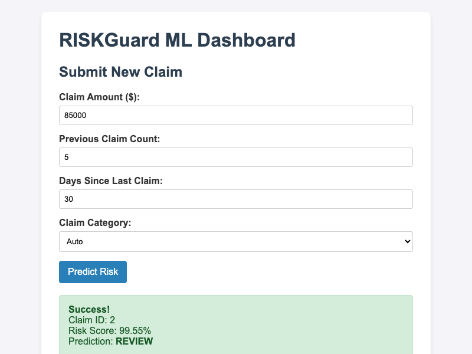
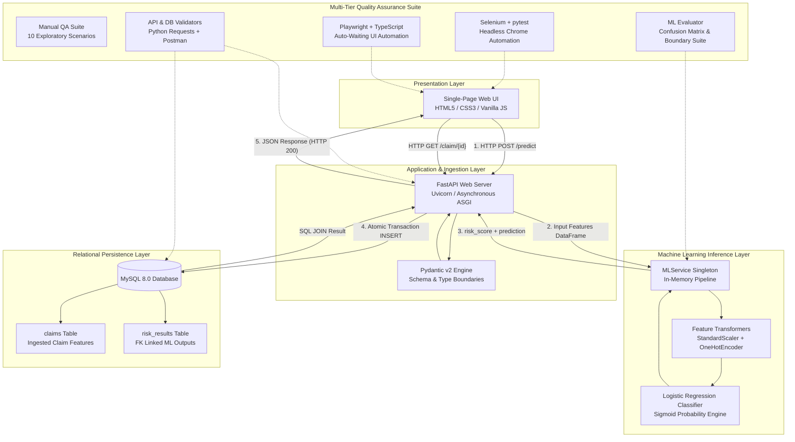
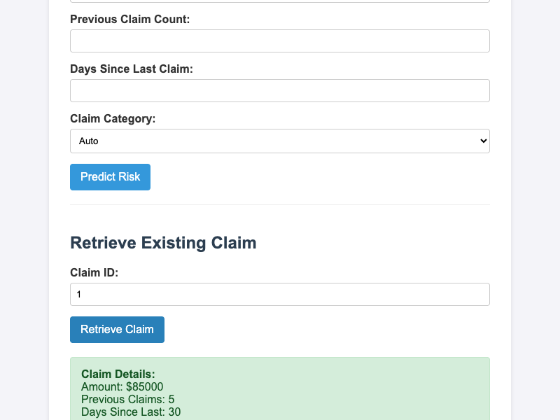
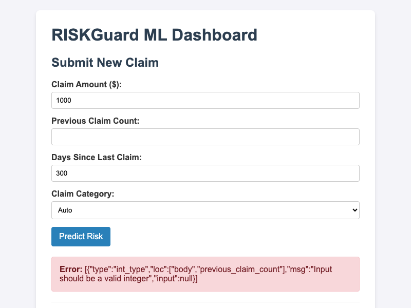
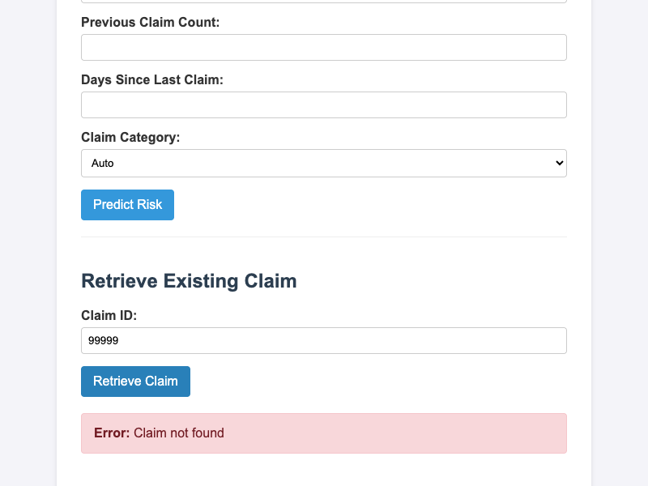

# RiskGuard

**A full-stack, ML-integrated insurance claim risk assessment platform and multi-tier QA test laboratory.**

[](https://www.python.org/)
[](https://fastapi.tiangolo.com/)
[](https://scikit-learn.org/)
[](https://www.mysql.com/)
[](https://playwright.dev/)
[](https://www.selenium.dev/)
[]()

> **Note on Scope**: RiskGuard is a structured test engineering laboratory and reference architecture designed to demonstrate full-lifecycle quality assurance across machine learning, REST APIs, UI automation, and relational persistence. The claim dataset is synthetic and has no real-world actuarial or underwriting validity.

---

## Quick Links

* [Interactive API Documentation (Swagger)](http://127.0.0.1:8000/docs) *(when running locally)*
* [Database Schema DDL](sql/schema.sql)
* [Incident Root Cause Analysis (RCA)](docs/troubleshooting-rca.md)
* [ML Evaluation & Behavioral Evidence](docs/ml_evaluation_evidence.txt)
* [Cross-Layer API & DB Validation Evidence](docs/api_db_validation_evidence.txt)
* [Postman Collection](docs/riskguard_postman_collection.json)
* [Manual Test Suite](docs/manual-test-cases.md)

---

## Visual Overview

<div align="center">
  
  <p><em>RiskGuard Single-Page Application: End-to-end synchronous prediction returning risk score, categorical decision, and transactional claim ID.</em></p>
</div>

---

## 🎯 Problem

In modern enterprise software, machine learning inference is increasingly embedded inside transaction-critical workflows. However, engineering and quality assurance practices around ML-backed applications remain siloed:

1. **Disconnected Verification**: Data science teams validate models in Jupyter notebooks using static offline holdout sets, while software QA teams test UIs and APIs as black boxes without verifying how probabilistic outputs interact with transactional constraints.
2. **Persistence & Boundary Mismatches**: Machine learning inference components frequently operate on continuous unbounded numeric spaces, whereas relational databases and business domains require strict bounds (e.g., column decimal widths, foreign key integrity, non-negative monetary constraints).
3. **Debugging Opacity**: When an end-to-end transaction fails, generic HTTP 500 status codes mask whether the failure originated in schema validation, matrix transformation, model inference, or relational persistence.

There is a lack of compact, observable reference systems where engineers and test architects can study and defend the entire lifecycle—from browser interaction and schema validation through ML inference and relational persistence—under automated test harnesses.

---

## 💡 Solution

RiskGuard solves this by providing a unified, decoupled, four-tier architecture designed specifically for comprehensive observability and multi-layer validation:

* **What the user provides**: Structured claim parameters (monetary amount, historical claim count, days since last claim, and insurance policy category).
* **What the system executes**: Strict schema parsing via Pydantic, dynamic feature scaling and one-hot encoding, real-time Logistic Regression probability inference, atomic two-table MySQL relational persistence, and state retrieval via SQL JOINs.
* **What the user receives**: Immediate, transparent risk assessment (`NORMAL` vs. `REVIEW`), a calibrated risk probability score, and an immutable persistence record accessible via unique claim ID.
* **How quality is assured**: Multi-tier testing encompassing manual test plans, automated API contract validation, direct relational database verification, dual-framework UI automation (Python/Selenium and TypeScript/Playwright), and behavioral ML evaluation.

---

## ✨ Key Capabilities

* **Synchronous End-to-End ML Inference**: Seamless real-time inference using a serialized Scikit-Learn pipeline without requiring distributed model servers or async queue overhead.
* **Multi-Layer Validation Boundaries**: Defensive validation enforced across three levels: frontend DOM form constraints, FastAPI/Pydantic v2 input schemas, and MySQL DDL table constraints.
* **Atomic Two-Table Relational Transactions**: Claim submissions commit to both `claims` and `risk_results` tables inside an atomic database transaction with rollback protection.
* **Dual-Stack UI Automation**: Parallel automated UI test suites implemented in both **Python + Selenium + pytest** and **TypeScript + Playwright**, enabling direct comparative evaluation of selector engines, wait strategies, and execution speeds.
* **Cross-Layer Data Integrity Validation**: Automated test scripts verifying relational foreign key integrity, SQL JOIN accuracy, aggregate statistics, and 100% field parity between API responses and database state.
* **ML Behavioral & Boundary Evaluation**: Statistical verification on held-out test data (Confusion Matrix, Precision, Recall, F1) combined with behavioral stress-testing at valid boundary extremes.
* **Documented Defect Isolation (RCA)**: Comprehensive Root Cause Analysis case studies documenting actual defect discoveries, layer isolation methodologies, and regression verifications.

---

## 🏗️ Architecture

RiskGuard implements a decoupled, single-responsibility architecture where each layer communicates through typed, explicit contracts:



---

## 🔄 End-to-End Workflow

### Claim Submission & Risk Assessment Flow (`POST /predict`)

1. **User Input**: The user inputs claim parameters into the web interface and clicks **Predict Risk**.
2. **Client Dispatch**: JavaScript intercepts the submit event (`e.preventDefault()`), builds a typed JSON payload, and dispatches an asynchronous `POST` request to `http://127.0.0.1:8000/predict`.
3. **Contract Validation**: FastAPI intercepts the request; Pydantic validates datatypes and numeric boundary conditions (`ge=0`). Invalid requests immediately return `HTTP 422 Unprocessable Entity` or `HTTP 400 Bad Request`.
4. **ML Inference**: Validated features are converted to a Pandas DataFrame and processed by the in-memory Scikit-Learn pipeline. Features are standardized and one-hot encoded, and the classifier generates calibrated class probabilities via the logistic sigmoid function.
5. **Atomic Relational Persistence**: FastAPI opens a database transaction via `mysql-connector-python`:
   * Inserts raw claim data into `claims`; captures generated `claim_id`.
   * Inserts `claim_id`, `risk_score`, and `prediction` into `risk_results`.
   * Commits the transaction (or rolls back on error).
6. **Response & Rendering**: FastAPI serializes the response into a `PredictResponse` schema and returns `HTTP 200 OK`. The frontend updates the DOM dynamically to display a success badge, risk score percentage, and categorical determination.

### Claim Retrieval Flow (`GET /claim/{id}`)

1. **Lookup Request**: User enters a Claim ID and clicks **Retrieve Claim** (`GET /claim/{id}`).
2. **Database JOIN**: FastAPI executes an inner JOIN between `claims` and `risk_results` on `claim_id`.
3. **Response**: If found, returns `HTTP 200 OK` with full historical claim inputs and risk outcomes. If nonexistent, returns `HTTP 404 Not Found`.

---

## 🧠 Technical Approach

### 1. Machine Learning Inference Pipeline
* **Model Type**: Binary Logistic Regression trained with L2 regularization (`random_state=42`).
* **Preprocessing Architecture**: Built using Scikit-Learn's `ColumnTransformer` and bundled into an atomic `Pipeline`:
  * Continuous features (`claim_amount`, `previous_claim_count`, `days_since_last_claim`) are normalized using `StandardScaler` ($\mu=0, \sigma=1$).
  * Categorical features (`claim_category`) are encoded via `OneHotEncoder(handle_unknown='ignore')`.
* **Inference Serving**: Serialized with `joblib` into `models/risk_model.joblib`. Loaded once as a singleton (`MLService`) during FastAPI application lifecycle startup to ensure low-latency inference without disk I/O bottlenecks.
* **Calibrated Output**: Produces continuous risk scores between `0.0000` and `1.0000` (`predict_proba`) mapped against a strict `0.5` classification threshold to yield `NORMAL` vs. `REVIEW`.

### 2. API Contract & Validation Tier
* **Framework**: FastAPI with ASGI server Uvicorn.
* **Schema Enforcement**: Built on Pydantic v2 models (`ClaimRequest`, `PredictResponse`, `ClaimResponse`). Ensures strict type coercion, structural integrity, and descriptive automatic OpenAPI (`/docs`) schemas.
* **HTTP Semantics**:
  * `200 OK`: Successful prediction or retrieval.
  * `400 Bad Request`: Business rule violation (e.g., unrecognized claim category) or non-numeric lookup ID.
  * `404 Not Found`: Query for non-existent claim entity.
  * `422 Unprocessable Entity`: Type mismatch, missing required parameter, or negative numeric input.
  * `500 Internal Server Error`: Managed unexpected database or system failure.

### 3. Database Architecture & Relational Persistence
* **Engine**: MySQL 8.0 with InnoDB storage engine.
* **Schema Design**: Normalized two-table schema with primary/foreign key relationships and DDL-level check constraints:
  * `claims`: Stores input features (`claim_id` PK, `claim_amount`, `previous_claim_count`, `days_since_last_claim`, `claim_category`, `created_at`).
  * `risk_results`: Stores model outputs (`result_id` PK, `claim_id` FK, `risk_score`, `prediction`, `created_at`).
* **Relational Integrity**: Enforced foreign key constraint (`ON DELETE CASCADE`) and parameterized SQL queries to prevent SQL injection vulnerabilities.

---

## 🛠️ Technology Stack

| Layer / Component | Technology | Version | Purpose & Selection Rationale |
|---|---|---|---|
| **API Runtime** | FastAPI | `0.141.1` | High-performance async ASGI web framework with native Pydantic validation and auto-generated OpenAPI docs. |
| **ASGI Server** | Uvicorn | `0.52.1` | Lightweight, lightning-fast ASGI server implementation for Python. |
| **Validation Engine**| Pydantic | `2.13.4` | High-speed data parsing and contract validation using Python type hints. |
| **ML Engine** | scikit-learn | `1.9.0` | Industry-standard toolkit for reproducible preprocessing pipelines and classification models. |
| **Data Processing**| pandas | `3.0.5` | In-memory tabular data manipulation for training and inference input reconstruction. |
| **Model Packaging**| joblib | `1.5.3` | Optimized pipeline serialization preserving feature transformers and estimator weights. |
| **Database** | MySQL Server | `8.0+` | Relational ACID-compliant storage engine demonstrating transaction management and relational constraints. |
| **DB Driver** | mysql-connector-python | `26.7.0` | Native MySQL driver used without heavy ORMs to maintain direct visibility into raw SQL queries and transactions. |
| **Primary Automation**| Selenium WebDriver | `4.47.0` | Established cross-browser automation suite paired with `pytest` fixtures for headless UI testing. |
| **Secondary Automation**| Playwright (TypeScript)| `1.62.1` | Next-generation UI testing engine featuring auto-waiting, built-in tracing, and modern selector locators. |
| **API Testing** | Python Requests | `2.34.2` | Automated HTTP integration test execution and contract assertion. |

---

## ⚖️ Design Decisions & Trade-offs

| Architectural Decision | Chosen Approach | Alternative Considered | Technical Rationale & Trade-off |
|---|---|---|---|
| **Database Access Layer** | Raw SQL (`mysql-connector-python`) | Heavy ORM (SQLAlchemy / Tortoise) | **Rationale**: Maximizes SQL transparency, precise transaction management, and explicit schema alignment for database validation testing.<br/>**Trade-off**: Requires writing explicit parameterized SQL statements rather than object-relational mapping models. |
| **Model Serving Architecture** | In-Process Embedded Singleton | Dedicated Model Server (Triton / TorchServe / Flask microservice) | **Rationale**: Eliminates network hop overhead, serialization latency, and deployment complexity for lightweight tabular models.<br/>**Trade-off**: Model scaling is coupled with API worker scaling rather than autoscaled independently. |
| **Frontend Implementation** | Vanilla HTML5 / CSS3 / JavaScript | Modern JS Framework (React / Vue / Angular) | **Rationale**: Ultra-fast build-free setup, crystal-clear DOM structure for UI test locators, and zero node dependency bloat on the frontend.<br/>**Trade-off**: Lacks component state management and virtual DOM diffing found in larger single-page frameworks. |
| **UI Automation Frameworks** | Dual Stack (Selenium + Playwright) | Single Test Suite | **Rationale**: Allows direct engineering evaluation of legacy explicit-wait paradigms (Selenium) vs. modern asynchronous auto-waiting engines (Playwright).<br/>**Trade-off**: Requires maintaining two separate test suites and runtime environments (Python venv and Node npm). |
| **Persistence Strategy** | Synchronous Relational Commit | Asynchronous Message Queue (RabbitMQ / Kafka / Celery) | **Rationale**: Guarantees immediate read-after-write consistency so users and UI automation suites can instantly query newly generated claim records.<br/>**Trade-off**: HTTP response latency includes database write time (approx. 5-10ms). |

---

## 🧩 Engineering Challenges & Root Cause Analyses

Real engineering projects surface genuine defects during integration. Rather than hiding these failures, RiskGuard documents them through systematic Root Cause Analysis (RCA):

### Incident 1: SQL Column Identifier Mismatch on Claim Retrieval

* **Challenge**: After initial backend deployment, submitting claims (`POST /predict`) succeeded with HTTP 200, but subsequent lookups via `GET /claim/{id}` consistently returned `HTTP 500 Internal Server Error`.
* **Investigation & Layer Isolation**:
  1. *Client layer*: Request URL and headers were correctly structured.
  2. *API routing layer*: Route parameter matched and handler was invoked.
  3. *Database query layer*: Isolating the raw SQL revealed MySQL error `1054 (42S22): Unknown column 'c.id' in 'where clause'`.
  4. *Schema comparison*: The query in `backend/db.py` referenced `c.id`, but the authoritative database schema defined the primary key as `claim_id`.
* **Solution**: Corrected the SQL query in `backend/db.py` across 3 lines (`c.claim_id as claim_id`, `JOIN ... ON c.claim_id = r.claim_id`, and `WHERE c.claim_id = %s`).
* **Result**: `GET /claim/{id}` executed cleanly, returning `HTTP 200 OK` with full claim and ML risk details. Verified via automated tests without schema modifications.

### Incident 2: ML Test Scope Divergence vs. Application Validation Limits

* **Challenge**: In early ML testing, an extreme test scenario with `claim_amount = 999,999,999` and `previous_claim_count = 99` was documented as passing with stability. However, submitting the exact same payload through the live `POST /predict` API triggered an immediate `HTTP 500 Internal Server Error`.
* **Investigation & Layer Isolation**:
  1. *Direct model call*: Invoking `model.predict()` directly in memory passed without error because the Logistic Regression sigmoid function mathematically constrains output to $[0.0, 1.0]$ regardless of feature magnitude.
  2. *Full-stack call*: Sending the payload through FastAPI succeeded at Pydantic parsing (`ge=0`), but failed at MySQL execution with an out-of-range database error. MySQL `DECIMAL(10,2)` has a maximum ceiling of `99,999,999.99`.
  3. *Root Cause*: The test was mislabeled as an "application boundary test," but was actually an isolated component test that bypassed the database persistence layer.
* **Solution**: Clarified test scope separation. Relabeled the in-memory test as an *Out-of-domain ML robustness observation*, and created a real *Application Boundary Test* executing through the live API with the system's declared maximum bounds (`amount = 1,000,000`, `count = 50`, `days = 3650`).
* **Result**: The real boundary test executed cleanly through the full stack (`HTTP 200 OK`, `risk_score = 1.0`, `prediction = REVIEW`) and verified database persistence.

> Full step-by-step investigation reports, logs, and reproduction details are documented in [`docs/troubleshooting-rca.md`](docs/troubleshooting-rca.md).

---

## 📊 Evaluation & Empirical Results

### Machine Learning Model Metrics (Held-Out Test Set)

Evaluated on an 80-sample stratified test partition ($N=80$) from the 400-row synthetic dataset:

```text
               Predicted NORMAL | Predicted REVIEW
Actual NORMAL |             46 |                4
Actual REVIEW |              6 |               24
```

| Metric | Measured Value | Meaning in Context |
|---|---|---|
| **Accuracy** | **87.50%** | Proportion of total claims correctly classified. |
| **Precision** | **85.71%** | When flagged as `REVIEW`, the probability the claim is high risk ($24 / [24 + 4]$). |
| **Recall** | **80.00%** | Proportion of actual high-risk claims captured by the model ($24 / [24 + 6]$). |
| **F1 Score** | **82.76%** | Harmonic mean of precision and recall. |
| **True Negatives**| **46** | Low-risk claims correctly categorized as `NORMAL`. |
| **False Negatives**| **6** | High-risk claims that were missed (critical risk metric in insurance QA). |

### Behavioral ML Test Scenarios

| Scenario | Input Features | Expected Behavior | Observed Result | Status |
|---|---|---|---|---|
| **1. Low Risk** | Amount: \$250, Prior: 0, Days: 1500, HOME | Score $< 0.5$, Class `NORMAL` | Score: `0.0000`, Class: `NORMAL` | ✅ PASS |
| **2. High Risk** | Amount: \$85,000, Prior: 5, Days: 10, AUTO | Score $\ge 0.5$, Class `REVIEW` | Score: `0.9959`, Class: `REVIEW` | ✅ PASS |
| **3. Ambiguous** | Amount: \$15,000, Prior: 1, Days: 180, AUTO | Moderate score, baseline check | Score: `0.0052`, Class: `NORMAL` | ✅ PASS |
| **4. Valid Boundary**| Amount: \$1,000,000, Prior: 50, Days: 3650, AUTO | Max valid input, full stack pass | Score: `1.0000`, Class: `REVIEW` | ✅ PASS |

### Automated Test Suite Execution Summary

| Test Suite | Implementation | Scenarios Tested | Execution Time | Status |
|---|---|---|---|---|
| **Selenium UI Tests** | Python, `pytest`, Headless Chrome | 5 scenarios (Submit, Validation, Retrieve, 404, Debug) | ~12.5s | ✅ **5/5 Passed** |
| **Playwright UI Tests**| TypeScript, `@playwright/test` | 5 scenarios (Typed Submission, Validation, Retrieval, 404, Debug) | ~5.3s | ✅ **5/5 Passed** |
| **API Integration** | Python `requests` | 6 scenarios (200 OK, 422 Missing, 422 Bad Type, 422 Range, 404) | ~0.8s | ✅ **6/6 Passed** |
| **Database Integrity** | MySQL Connector + Python | 5 assertions (Row count, PK/FK links, JOIN parity, Aggregation) | ~0.4s | ✅ **5/5 Passed** |

---

## 🧪 Concrete API Examples

### 1. Predict Claim Risk (`POST /predict`)

**Request:**
```http
POST /predict HTTP/1.1
Host: 127.0.0.1:8000
Content-Type: application/json

{
  "claim_amount": 85000.0,
  "previous_claim_count": 5,
  "days_since_last_claim": 30,
  "claim_category": "AUTO"
}
```

**Response (`200 OK`):**
```json
{
  "claim_id": 1,
  "risk_score": 0.9959,
  "prediction": "REVIEW"
}
```

### 2. Retrieve Stored Claim (`GET /claim/{id}`)

**Request:**
```http
GET /claim/1 HTTP/1.1
Host: 127.0.0.1:8000
```

**Response (`200 OK`):**
```json
{
  "claim_id": 1,
  "claim_amount": 85000.0,
  "previous_claim_count": 5,
  "days_since_last_claim": 30,
  "claim_category": "AUTO",
  "risk_score": 0.9959,
  "prediction": "REVIEW"
}
```

### 3. Schema Boundary Rejection (`POST /predict`)

**Request with invalid negative amount:**
```json
{
  "claim_amount": -500.0,
  "previous_claim_count": 0,
  "days_since_last_claim": 10,
  "claim_category": "HOME"
}
```

**Response (`422 Unprocessable Entity`):**
```json
{
  "detail": [
    {
      "type": "greater_than_equal",
      "loc": ["body", "claim_amount"],
      "msg": "Input should be greater than or equal to 0",
      "input": -500.0,
      "ctx": { "ge": 0.0 }
    }
  ]
}
```

---

## 📸 Interface Evidence

<details open>
<summary><strong>Click to expand UI interaction screenshots</strong></summary>
<br/>

| Scenario | Screenshot Evidence |
|---|---|
| **Claim Submission (High Risk Review)** |  |
| **Claim Retrieval via Database JOIN** |  |
| **Schema Validation Error Display** |  |
| **404 Entity Not Found Handling** |  |

</details>

---

## 📁 Repository Structure

```text
RiskGuard/
├── backend/                       # Application & Persistence Services
│   ├── main.py                    # FastAPI application, CORS, route definitions
│   ├── schemas.py                 # Pydantic v2 request/response models
│   ├── ml_service.py              # ML inference service singleton
│   └── db.py                      # MySQL connection, transactions, and JOIN queries
├── frontend/                      # Presentation Layer (Vanilla SPA)
│   ├── index.html                 # Semantic HTML5 input & retrieval forms
│   ├── styles.css                 # Clean CSS layout and status badge styling
│   └── app.js                     # Asynchronous fetch client & DOM rendering
├── ml/                            # Machine Learning Development
│   ├── train.py                   # Model pipeline training & evaluation script
│   └── inspect_data.py            # Dataset distribution & structure analysis
├── models/                        # Serialized Model Artifacts
│   └── risk_model.joblib          # Frozen Scikit-Learn pipeline
├── data/                          # Datasets
│   └── riskguard_synthetic_claims.csv  # 400-row synthetic insurance claims data
├── sql/                           # Relational Database Definitions
│   └── schema.sql                 # MySQL DDL for claims and risk_results
├── tests/                         # Automated Testing Suites
│   ├── selenium/                  # Primary UI Automation (Python)
│   │   ├── conftest.py            # pytest fixtures, headless driver, failure hooks
│   │   └── test_ui.py             # 5 Selenium test scenarios
│   └── playwright/                # Secondary UI Automation (TypeScript)
│       ├── package.json           # Node dependencies (@playwright/test, typescript)
│       ├── playwright.config.ts   # Playwright project & browser configuration
│       └── ui.spec.ts             # 5 Playwright test scenarios
├── docs/                          # Engineering Documentation & Test Evidence
│   ├── troubleshooting-rca.md     # Root Cause Analysis for real integration bugs
│   ├── ml_evaluation_evidence.txt # Confusion matrix, metrics, and boundary logs
│   ├── api_db_validation_evidence.txt # API and database cross-layer execution logs
│   ├── manual-test-cases.md       # 10 formal manual test execution cases
│   ├── riskguard_postman_collection.json # Exported Postman test collection
│   ├── run_api_db_validations.py  # Automation script for API/DB verification
│   ├── run_ml_evaluation.py       # Script generating statistical ML evidence
│   └── screenshots/               # Captured manual QA and failure evidence
├── requirements.txt               # Pinned Python production & test dependencies
├── .gitignore                     # Rigorous exclusions (venv, node_modules, reports)
└── README.md                      # Project documentation
```

---

## ⚙️ Installation & Prerequisites

### Prerequisites
* **Python**: `3.10` or higher
* **MySQL**: `8.0` or higher (running locally on port `3306`)
* **Node.js**: `18.0` or higher (for Playwright test suite)
* **Google Chrome**: For Selenium and Playwright browser execution

### 1. Clone Repository & Setup Python Virtual Environment

```bash
git clone https://github.com/SRIVIGHNATEJA/RiskGuard.git
cd RiskGuard

python3 -m venv .venv
source .venv/bin/activate        # Windows: .venv\Scripts\activate
pip install -r requirements.txt
```

### 2. Configure Environment Variables

Create a `.env` file in the project root:

```ini
DB_HOST=127.0.0.1
DB_PORT=3306
DB_USER=riskguard_user
DB_PASSWORD=your_secure_password
DB_NAME=riskguard
```

### 3. Initialize MySQL Database Schema

Initialize the tables and grant privileges to your application user:

```bash
mysql -u root -p < sql/schema.sql
```

```sql
CREATE USER IF NOT EXISTS 'riskguard_user'@'localhost' IDENTIFIED BY 'your_secure_password';
GRANT ALL PRIVILEGES ON riskguard.* TO 'riskguard_user'@'localhost';
FLUSH PRIVILEGES;
```

### 4. Install Playwright Test Engine (Optional, for TypeScript UI Tests)

```bash
cd tests/playwright
npm install
npx playwright install chromium
cd ../..
```

---

## 🚀 Running the Project

### Start Backend API Server

```bash
source .venv/bin/activate
uvicorn backend.main:app --host 127.0.0.1 --port 8000
```
* Interactive API Documentation: [http://127.0.0.1:8000/docs](http://127.0.0.1:8000/docs)

### Start Frontend Application Server

In a separate terminal:

```bash
cd frontend
python3 -m http.server 8080 --bind 127.0.0.1
```
* Web Application Interface: [http://127.0.0.1:8080](http://127.0.0.1:8080)

---

## 🧪 Test Execution Guide

### 1. Primary UI Automation (Selenium + pytest)
*Requires backend (8000) and frontend (8080) running.*

```bash
source .venv/bin/activate
pytest tests/selenium/ -v
```

### 2. Secondary UI Automation (Playwright + TypeScript)
*Requires backend (8000) and frontend (8080) running.*

```bash
cd tests/playwright
npx playwright test
```

### 3. API & Database Cross-Layer Validation
*Requires backend running and MySQL accessible.*

```bash
source .venv/bin/activate
python3 docs/run_api_db_validations.py
```

### 4. ML Model Evaluation & Boundary Testing
*Runs offline against `models/risk_model.joblib` and test data.*

```bash
source .venv/bin/activate
python3 docs/run_ml_evaluation.py
```

---

## 🔐 Environment Variables

| Variable | Purpose | Default | Required |
|---|---|---|---|
| `DB_HOST` | Hostname/IP address of the MySQL database | `127.0.0.1` | No |
| `DB_PORT` | Port number of the MySQL server | `3306` | No |
| `DB_USER` | MySQL database user | `root` | Yes |
| `DB_PASSWORD` | MySQL user password | `""` | Yes |
| `DB_NAME` | Relational database schema name | `riskguard` | No |

---

## ⚠️ Limitations & Boundary Constraints

* **Synthetic Data Environment**: The 400-row claim dataset was algorithmically generated for educational and testing purposes. It does not represent real actuarial distributions or underwriting principles.
* **Simplified Linear Modeling**: Uses a single Logistic Regression classifier. The system deliberately does not incorporate hyperparameter sweeps, ensemble methods (XGBoost/RandomForest), or deep neural networks to maintain focus on architectural testability.
* **Authentication Omission**: The API endpoints are unauthenticated by design to streamline local exploratory testing, load verification, and automated test runners.
* **Local Development Focus**: Built for single-instance local execution without distributed container orchestration (Docker/K8s) or cloud-hosted database clusters.
* **Asymmetric Numeric Bounds**: Upper application thresholds (e.g., maximum claim amount of \$1,000,000) are enforced primarily via relational column definitions (`DECIMAL(10,2)`) and business rules rather than restrictive Pydantic upper bounds.

---

## 🔮 Future Roadmap

* **CI/CD Pipeline Integration**: Package test execution into a GitHub Actions matrix workflow running headless Chrome and Playwright containers on pull requests.
* **Containerized Deployment**: Multi-container `docker-compose.yml` orchestrating FastAPI, MySQL 8.0, and static Nginx frontend services with health checks.
* **Model Observability & Drift Detection**: Scheduled monitoring utilities computing Kolmogorov-Smirnov statistics to detect feature distribution drift on incoming production claims.
* **Expanded Underwriting Features**: Enrichment of schema to include multi-vehicle/property risk factors and multi-class classification (`APPROVED`, `MANUAL_REVIEW`, `DECLINED`).

---

## 👨‍💻 Engineering Ownership & Contributions

This project was conceived, architected, implemented, and tested from scratch as an end-to-end software quality assurance laboratory:

* **Architecture & Backend**: Designed the four-tier architecture, implemented FastAPI routes, Pydantic validation schemas, and raw MySQL connection management.
* **Machine Learning Pipeline**: Cleaned synthetic datasets, implemented `ColumnTransformer` preprocessing pipelines, trained and serialized the Logistic Regression estimator.
* **Relational Database Design**: Authored normalized DDL scripts, implemented transactional insertions, and optimized multi-table SQL JOIN queries.
* **Test Engineering**: Authored and executed the manual test suite, built the Selenium/pytest automation harness, developed the Playwright/TypeScript test suite, and scripted the cross-layer API↔DB validation suite.
* **Root Cause Investigation**: Conducted systematic isolation of integration defects, documented RCA findings, and verified regression resolutions.

---

## 📄 License

This project is licensed under the terms of the [ISC License](https://opensource.org/licenses/ISC).